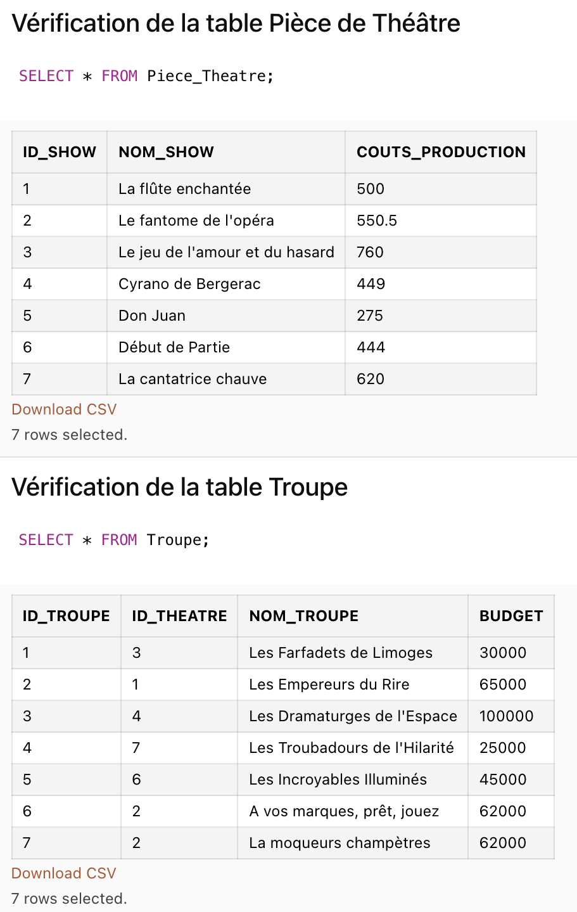
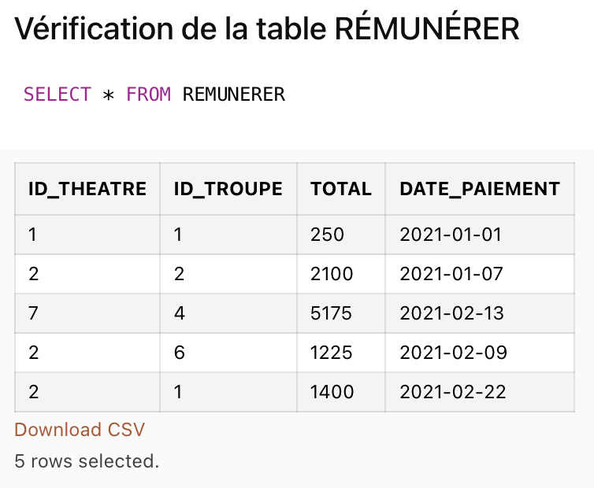

# Projet - Advanced Database - ST2ABD

## Timothée CASINI & Balthazar RAFFY

### Introduction

Ce projet à pour but de mettre en oeuvre les notions vu lors des TP et des CM tels que les Triggers, les User-Type, PL/SQL, l'Héritage, ...

Nous avons choisis d'utiliser le SGBD `Live Oracle` car il s'accorde avec les fonctionnalités que nous devons implémenter

#### Objectifs

L'objectif de ce projet est de simuler une base de données de gestion de troupes de théâtres.

Nous allons créer la base de données, insérer les données et la peupler, puis créer les fonctionnalités nécéssaires à travers différents triggers, fonctions et séléctions.

Le dossier se décompose en 3 dossier :
* `infos` : contient le sujet, les screens et le rapport du projet
* `graphs`: contient les différents graphiques (MCD, MLD, E/R)
* `scripts` : contient les scripts nécessaire à la réalisation du projet

#### Contraintes

Plusieurs contraintes orientent notre conception de la BDD mais certaines notions comme la gestion des dons, les calculs budgétaire, la gestion des tickets ainsi que la mise en place des contraintes de temps sont des choix libres.

Les contraintes sont les suivantes :
- Gestion des coûts (salaires, productions, déplacement)
- Gestion des tickets (réductions, rémunération)
- Gestion des dons (fréquences, durée)
- Gestion du temps (paiements, tickets, dons)
- Gestion des troupes et des représentations (1 troupe ne peut pas assurer 2 représentation à la fois)
- Gestion des pièce de théâtre et du théâtre(1 théâtre ne peut pas acceuilir + d'une pièce de théâtre à la fois)

### Création du modèle relationnel

Afin d'élaborder correctement notre BDD, nous allons construire le MCD et le E/R Diagramme puis en déduire le MLD.
Les diagrammes correspondants sont dans le dossier `graphs` qui contient les 3 fichiers des modèles et les diagrammes en PDF.

On trouve ainsi le modèle relationnel suivant :

- Troupe(**id_troupe**, nom_troupe, budget, *id_theatre*)

- Theatre(**id_theatre**, nom_theatre, capacite, adresse, couts_deplacement)

- PieceTheatre(**id_show**, nom_show, couts_production)

- Representation(**id_representation**, duree, date_debut, *id_troupe*, *id_theatre*, *id_show*)

- Spectateur(**id_spectateur**, email, reduction)

- Ticket(**id_ticket**, tarif_normal, tarif_reduit, date_achat, date_acces, *id_spectateur*, *id_theatre*)

- Dons(**id_don**, nom_donnateur, somme, frequence, date_debut, date_fin, *id_troupe*)

- Employe(**id_employe**, nom, type, salaire, *id_troupe*)

- REMUNERER(***id_theatre***, ***id_troupe***, date_paiement, total)

### Création des données 

La création des données se fait depuis le fichier `creation.sql` dans le dossier `scripts`

Après avoir créer le modèle relationnel, on créer la base de donné en s'assurant des contraintes de clés, check et unique

- Les couts sont tous supérieur ou égale à 0
- Contraintes de clés primaires et étrangères
- Tables en 3ème forme normale
- Un spectateur ne peut pas acheter plusieurs tiquet pour une même data d'accès
- Le type d'employé est forcément acteur ou staff
- Le type de reduction est forcément normal ou réduit

**On créer les 9 tables décrites ci-dessus.**

### Insertion des données

Une fois la BDD créer, on insère les données dans chacune des tables en respectant les contraintes. 
Les insertions sont disponibles depuis le fichier `insertion.sql` dans le dossier `scripts`.

Certaint triggers et contraintes doivent être ajoutés avant les insertions.

C'est le cas du trigger `Salaires_Shows` qui permet d'initialiser le montant global des salaires dans la table Representation pour une Pièce de Théâtre donnée.

* On s'assure du bon fonctionnement du trigger :

* On vérifie l'insertion des données :

### Triggers et Queries

